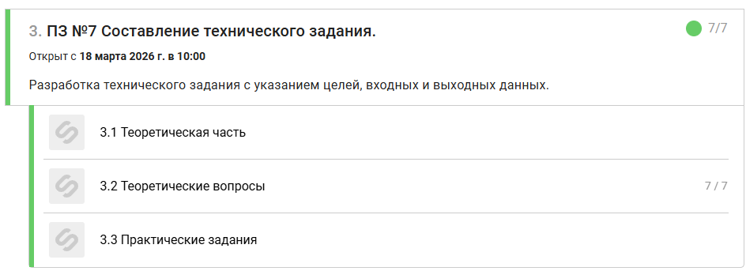

# Prakticheskoe_zadanie_7

## ПЗ_7

## Задача 1. Линейный алгоритм «Перевод времени»

**Название программы:** Перевод часов в минуты

**Цель:**\
Разработать программу, которая переводит время, заданное в часах, в
минуты.

**Входные данные:**\
- Число `h` --- количество часов

**Выходные данные:**\
- Число `m` --- количество минут

**Формула:**\
m = h \* 60

**Алгоритм:** 1. Ввести значение часов\
2. Умножить на 60\
3. Вывести результат

------------------------------------------------------------------------

## Задача 2. Алгоритм ветвления «Сравнение чисел»

**Цель:**\
Определить, какое из двух чисел больше.

**Входные данные:**\
- Числа `a` и `b`

**Выходные данные:**\
- Результат сравнения

**Алгоритм:** 1. Ввести `a`, `b`\
2. Если `a > b` → вывести "a больше b"\
3. Если `a < b` → вывести "b больше a"\
4. Иначе → "a равно b"

------------------------------------------------------------------------

## Задача 3. «Допуск к экзамену»

**Цель:**\
Определить допуск студента к экзамену.

**Входные данные:**\
- Пропуски `n`\
- Лабораторные (да/нет)

**Условие:**\
- Пропуски ≤ 5 и лабораторные сданы

**Алгоритм:** 1. Ввести данные\
2. Если условия выполнены → "Допущен"\
3. Иначе → "Не допущен"

------------------------------------------------------------------------

## Задача 4. «Скидка в магазине»

**Цель:**\
Рассчитать итоговую стоимость покупки.

**Входные данные:**\
- Сумма `S`

**Условия:** - ≥ 5000 → скидка 20%\
- ≥ 3000 → скидка 10%\
- иначе → 0%

**Алгоритм:** 1. Ввести `S`\
2. Определить скидку\
3. Рассчитать итог\
4. Вывести сумму

------------------------------------------------------------------------

## Задача 5. «Квадратное уравнение»

**Цель:**\
Решить уравнение ax² + bx + c = 0

**Входные данные:**\
- a, b, c

**Алгоритм:** 1. Ввести коэффициенты\
2. Если a = 0 → решить линейное уравнение\
3. Иначе: - Найти D = b² - 4ac\
- Если D \> 0 → два корня\
- Если D = 0 → один корень\
- Если D \< 0 → корней нет
